# TwinChef - Dual-LLM Recipe Recomentations

[](https://reactjs.org/)
[](https://nodejs.org/)
[](https://python.org/)
[](https://ai.google.dev/)
[](https://huggingface.co/TheBloke/Llama-2-7B-Chat-GGUF)
[](https://www.mongodb.com/products/platform/atlas-vector-search)

---

## 📌 Project Overview & Intentions

**TwinChef** is an AI-powered culinary companion designed to eliminate recipe search friction and reduce food waste. Instead of scouring static recipe books, users simply input the ingredients they have on hand and receive tailored recipe recommendations enriched by real-time semantic retrieval and Large Language Models.

### Core Intentions
- **Smart Ingredient Matching**: Turn any combination of pantry ingredients into structured recipe recommendations complete with preparation steps, cooking times, cuisine types, and nutritional context.
- **Dual-LLM Intelligence ("Twin Chef")**: Provide a dual-engine architecture allowing users to seamlessly toggle between cloud-based frontier models (**Google Gemini 1.5 Flash**) and self-hosted open-source models (**Meta LLaMA 2 7B via quantized GGUF**).
- **Interactive Culinary Assistant**: Enable conversational Q&A on any generated recipe — ask for substitutions, dietary modifications, cooking tips, or step-by-step troubleshooting in real time.
- **Semantic Vector Search**: Move beyond basic keyword filtering using dense vector embeddings (`SentenceTransformers`) and MongoDB Vector Search to understand semantic ingredient relationships.

---

## ✨ Key Features

- 🥗 **Dynamic Ingredient Auto-Complete**: Real-time autocomplete suggestions powered by a curated culinary ingredient dataset.
- 🔄 **Runtime LLM Switching**: Live toggle between Google Gemini AI and LLaMA 2 to compare responses, reasoning styles, and speed.
- 📖 **Comprehensive Recipe Cards**: Interactive view showing ingredients, preparation & cook times, cuisine, dietary category, servings, instructions, and images.
- 💬 **Context-Aware Reply System**: Select any recipe or chat bubble to start a focused sub-conversation without losing prior context.
- 🔁 **Continuous Recipe Pagination ("Load More")**: Progressively retrieve and batch additional matching recipes from the database.
- 🎨 **Modern Animated Interface**: Built with Framer Motion page transitions, GSAP staggered culinary fun facts, and responsive glassmorphism styles.

---

## 🏗️ System Architecture

TwinChef follows a decoupled, 3-tier microservice architecture:

```mermaid
flowchart TD
    %% Class Definitions for Color Coding
    classDef client fill:#E0F2FE,stroke:#0284C7,stroke-width:2px,color:#0F172A
    classDef gateway fill:#FEF3C7,stroke:#D97706,stroke-width:2px,color:#0F172A
    classDef endpoint fill:#FFFBEB,stroke:#F59E0B,stroke-dasharray: 4 4,color:#0F172A
    classDef gemini fill:#EEF2FF,stroke:#4F46E5,stroke-width:2px,color:#0F172A
    classDef llama fill:#FCE7F3,stroke:#DB2777,stroke-width:2px,color:#0F172A
    classDef database fill:#DCFCE7,stroke:#16A34A,stroke-width:2px,color:#0F172A

    subgraph ClientLayer ["🖥️ Client Layer (Port 3000)"]
        UI["⚛️ React 18 SPA"]:::client
        HP["🏠 HomePage / Trivia & Search"]:::client
        CB["💬 Chatbot & LLM Switcher"]:::client
        UI --> HP
        UI --> CB
    end

    subgraph GatewayLayer ["⚡ Orchestration API Gateway (Port 3001)"]
        EX["🚀 Express.js Proxy Server"]:::gateway
        R1["📡 POST /api/query"]:::endpoint
        R2["📡 POST /api/generate"]:::endpoint
        R3["📡 GET /api/loadmore"]:::endpoint
        EX --> R1
        EX --> R2
        EX --> R3
    end

    subgraph AIServices ["🧠 AI Microservices & Inference Layer"]
        subgraph GeminiEngine ["🔷 Gemini Microservice (Port 5002)"]
            G_FLASK["🐍 Flask API (Local)"]:::gemini
            GEMINI["✨ Google Gemini 1.5 Flash"]:::gemini
            G_SEARCH["🔍 MongoDB Text / Keyword Search"]:::gemini
            G_FLASK --> GEMINI
            G_FLASK --> G_SEARCH
        end

        subgraph LlamaEngine ["🦙 LLaMA 2 Microservice (GPU / Colab)"]
            L_FLASK["🌐 Flask API + pyngrok Tunnel"]:::llama
            SENT_TF["📐 SentenceTransformers (all-MiniLM-L6-v2)"]:::llama
            CT_LLAMA["🦙 ctransformers (Llama-2-7B-Chat-GGUF)"]:::llama
            L_VECSEARCH["🎯 MongoDB Vector Search ($vectorSearch)"]:::llama
            L_FLASK --> SENT_TF
            L_FLASK --> CT_LLAMA
            L_FLASK --> L_VECSEARCH
        end
    end

    subgraph StorageLayer ["💾 Data Persistence Layer"]
        MDB[("🍃 MongoDB Atlas (recipe_realm.recipes)")]:::database
    end

    %% Layer Interactions & Data Flow
    CB ==>|"HTTP / Axios"| EX
    R1 -->|"LLM = GeminiAI"| G_FLASK
    R1 -->|"LLM = Llama"| L_FLASK
    R2 -->|"Prompt & Context"| G_FLASK
    R2 -->|"Prompt & Context"| L_FLASK
    R3 -->|"Pagination"| G_FLASK
    R3 -->|"Pagination"| L_FLASK
    G_SEARCH ==> MDB
    L_VECSEARCH ==> MDB
```



### Architecture Breakdown

1. **Frontend (React 18 SPA)**:
   - Manages state, ingredient input, auto-completion, conversational history, and model selection.
   - Communicates exclusively with the Node.js API Gateway.

2. **API Gateway (Node.js / Express)**:
   - Acts as a unified middleware layer and reverse proxy.
   - Routes incoming queries, generation prompts, and pagination requests dynamically to either the local Gemini service or the remote/tunneled LLaMA service based on user preference.

3. **AI Inference & Retrieval Microservices (Python / Flask)**:
   - **Gemini Engine (`GeminAI.ipynb`)**: Flask application utilizing `google-generativeai` (`gemini-1.5-flash`) paired with MongoDB Atlas Search aggregation pipelines.
   - **LLaMA 2 Engine (`LLama_Server_final.ipynb`)**: GPU-accelerated Flask application leveraging `ctransformers` for quantized local inference (`Llama-2-7B-Chat.Q5_K_M.gguf`), `sentence-transformers` for dense embeddings (`all-MiniLM-L6-v2`), and MongoDB Atlas `$vectorSearch`.

4. **Data Layer (MongoDB Atlas)**:
   - Stores recipe documents with attributes (`RecipeName`, `Ingredients`, `Instructions`, `Cuisine`, `Diet`, `PrepTimeInMins`, `CookTimeInMins`, `image-url`, and 384-dimensional `ingredient_embedding` vectors).

---

## 🛠️ Tech Stack

| Domain | Technologies |
| :--- | :--- |
| **Frontend** | React 18, React Router v6, Framer Motion, GSAP, Bootstrap 5, React-Bootstrap, FontAwesome, Axios, CSS3 |
| **Gateway / Middleware** | Node.js, Express.js, Body-Parser, CORS, Axios |
| **AI / ML & NLP** | Google Generative AI (`gemini-1.5-flash`), `ctransformers` (`Llama-2-7B-Chat-GGUF`), `sentence-transformers` (`all-MiniLM-L6-v2`), PyTorch, Scikit-learn |
| **Microservice Framework** | Python 3, Flask, PyMongo, Pyngrok (for tunneling Colab GPU endpoints) |
| **Database & Vector Search** | MongoDB Atlas (Vector Search & Text Search Aggregation) |

---

## 🚀 Getting Started

### 1. Prerequisites
- **Node.js** (v16+ recommended) & **npm**
- **Python** (v3.10+ recommended)
- **MongoDB Atlas** cluster with vector index configured
- **Google AI Studio API Key** (for Gemini)
- **Ngrok Account & Token** (for tunneling Colab GPU LLaMA server)

---

### 2. Setting Up the AI Microservices

#### Option A: Google Gemini Service (Local / Colab)
1. Open `GeminAI.ipynb` or export to a Python script.
2. Set your environment variables:
   ```bash
   export MONGODB_URI="your_mongodb_connection_string"
   export GEMINI_API_KEY="your_google_gemini_api_key"
   ```
3. Run the Flask server:
   ```python
   app.run(host='0.0.0.0', port=5002)
   ```

#### Option B: LLaMA 2 Service (Google Colab with GPU recommended)
1. Open `LLama_Server_final.ipynb` in **Google Colab** (ensure GPU hardware accelerator is enabled: T4 or higher).
2. Configure your Colab Secrets (`userdata`):
   - `mongodb`: Your MongoDB Atlas URI
   - `ngrok`: Your Ngrok Auth Token
   - `domain`: (Optional) Custom Ngrok reserved domain
3. Execute all notebook cells. The server will download the quantized model `Llama-2-7B-Chat.Q5_K_M.gguf`, start the Flask app, and expose a public ngrok tunnel URL (e.g., `https://your-domain.ngrok-free.app`).
4. Update `LLM2_URL` in `backend/server.js` with your ngrok URL.

---

### 3. Running the Backend Gateway

1. Navigate to the backend folder:
   ```bash
   cd backend
   ```
2. Install dependencies:
   ```bash
   npm install
   ```
3. Start the server:
   ```bash
   node server.js
   ```
   *The API Gateway runs on `http://localhost:3001`.*

---

### 4. Running the Frontend Application

1. Open a new terminal and navigate to the frontend folder:
   ```bash
   cd frontend
   ```
2. Install dependencies:
   ```bash
   npm install
   ```
3. Start the development server:
   ```bash
   npm start
   ```
   *The client will launch on `http://localhost:3000`.*

---

## 🔌 API Gateway Endpoints

| Method | Endpoint | Description | Payload / Params |
| :--- | :--- | :--- | :--- |
| `POST` | `/api/query` | Queries recipes matching input ingredients via the selected LLM microservice | `{ "llm": "GeminiAI" \| "Llama", "query": "tomato, onion, garlic" }` |
| `POST` | `/api/generate` | Generates context-aware cooking answers or replies | `{ "llm": "GeminiAI" \| "Llama", "context": "...", "prompt": "Can I substitute onions?" }` |
| `GET` | `/api/loadmore` | Fetches next batch of recipes from the active search session | Query Param: `?llm=GeminiAI` or `?llm=Llama` |

---

## 🔒 Configuration & Environment Variables

| Variable | Scope | Description |
| :--- | :--- | :--- |
| `MONGODB_URI` | Gemini / LLaMA Microservice | MongoDB Atlas connection string |
| `GEMINI_API_KEY` | Gemini Microservice | Google AI Studio Gemini API Key |
| `ngrok` | LLaMA Colab Notebook | Ngrok authentication token for tunnel creation |
| `PORT` | Backend Gateway | Gateway port (Default: `3001`) |
| `LLM1_URL` | Backend Gateway (`server.js`) | Endpoint for Gemini Flask service (`http://localhost:5002`) |
| `LLM2_URL` | Backend Gateway (`server.js`) | Public / Ngrok endpoint for LLaMA Flask service |

---

## 💡 Usage Workflow

1. **Enter Ingredients**: On the landing page or chat input, type at least 3 ingredients (e.g., `chicken, garlic, rosemary`). Use suggestions for best results.
2. **Explore Recipes**: Browse generated recipes with complete instruction sets, cooking times, and images. Click on recipe titles to expand or collapse details.
3. **Toggle Models**: Use the switch toggle in the input bar to compare answers between **Gemini AI** and **LLaMA 2**.
4. **Ask Questions**: Click the **Reply** icon on any recipe message to ask specific questions (e.g., *“How do I make this dairy-free?”* or *“What temperature should I set the oven to?”*).
5. **Load More**: Click **Load More** to view additional recipe alternatives.

---

## 📜 License

This project is private and unlicensed. All rights reserved.
